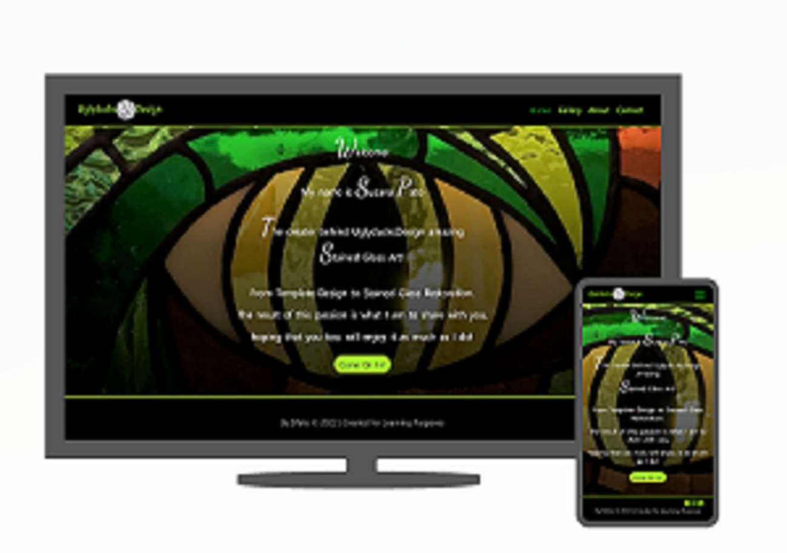

# My Portfolio-Milestone One

This is a Portfolio that I´ve created as my first project of the Frontend Developer Course. My Portfolio works as a showroom for my Art work and links it to the brand "UglyducksDesign" which is at the moment a fictional online shop. Each page contains social media links that users can access to get to know more about my work.
This webpage is also for current and potential clients interested in getting to know me better and learn more about Stained Glass, were they can find a brief explanation of the technique and its origins.



## UX

I've chosen to style my website in a way that would really bring out the colours of the art work exhibited in the pictures. A black background does exactly that, pulls the users attention to Stained Glass bright and vivid colours. I´ve chosen to avoid bright white coloured text to allow for more eye confort and increased focus when browsing through different sections.
Colour pallet: Green #008000, Greenyellow #adff2f, Black #000000 and #ffffff99 for the text.
As this is a website deeply linked to a hand made craft I´ve used "Dancing Script" font from Google Fonts to style some characters in the text and the signature in "About" page, giving it a more personal, artisan handwriting kind of look.

## User Stories
- As a potential client I want to know more about the artist and her story so that I can feel more confident and trust in her skills.
- As the designer I want clients to be able to match their expectations to my work and be abble to easily contact me and feel free to enquire about potencial projects.
- As Stained Glass fan I want to browse through the images and find inspiration for a piece that would look amazing in my house.
- As an event organiser I want to know more about the designer and her work so that I can decide whether to invite her to take part in an upcoming Crafts Fair.

## Wireframes

My wireframes helped as an inicial plan of how I would like my Portfolio to look like in terms of
its structure, I have choosen not too include to much detail, instead I have focused more on the importance of building a responsive website. 
With that in mind, I have created two wireframes per page, one for larger 
screens and another one for smaller screens.
I drew my wireframes using Balsamiq and the links to the files are below:

- [index.html](https://github.com/Susafp/Portfolio-Milestone-Project-One/blob/5e9419914e2b7dfed975c85e5775f9aa16583e2a/wireframes/home-page-wireframe.png)
- [gallery.html](https://github.com/Susafp/Portfolio-Milestone-Project-One/blob/5e9419914e2b7dfed975c85e5775f9aa16583e2a/wireframes/gallery-page-wireframe.png)
- [about.html](https://github.com/Susafp/Portfolio-Milestone-Project-One/blob/5e9419914e2b7dfed975c85e5775f9aa16583e2a/wireframes/about-page-wireframe.png)
- [contact.html](https://github.com/Susafp/Portfolio-Milestone-Project-One/blob/5e9419914e2b7dfed975c85e5775f9aa16583e2a/wireframes/contact-page-wireframe.png)


## Features

### All Pages

- **Navigation bar** - Located in the navigation bar, allows users to navigate around my website by clicking each navigation link, which redirects them to the relevant webpage. It has an hover feature that changes the colour and size of the links. To help users to always know which page they in, the links colour of the current visited page will appear in the darker shade of green.
- **Hamburger button** -  Clicking the hamburger button, a menu containing the navigation links to all my website pages will appear underneath the Logo. The user can click the links to navigate to the relevant webpage.
Only visible in screen sizes under 576px.
- **Footer with Social media links** - These links are located in the Footer of all my website pages (Facebook, Instagram and LinkedIn). Hover feature that changes the colour of the icons, it makes it easy for users to find and access different relevant social media pages and as it opens on a different tab it avoids loosing track of the page they were inicially. 

### All Pages exluding index.html

- **Navbar clickable logo** - With hover feature that changes the link colour and size. Users can go back to home page from all the other pages, this is especially useful in smaller screens when the navigation links are hidden under the hamburger button.
### Index Page

- **Welcome text** - Short text as a welcome message, together with the vivid background image it gives the visitors an idea of what the wepage is about.
- **'Come On In!' call to action button** - This is a button which main goal is to "tempt" users curiosity,
compelling them to engage with the webpage. Users are able to click, and it will take them to visit the gallery page.
### Gallery Page

- **Unordered list** - A list of the services provided that works as well as a side discription for the carousel images.
- **Carousel with indicators and controls** - The carousel contains ten pictures of Template designing, Painting and Stained Glass finished projects, which slide automatically. Alternatively, users can use the controls to manually slide forwards or backwards through the images. The indicators allow users to see which image of the series they are viewing.
- **Social media link** - A link to the Instagram shop. The link is functional but in reality "UglyducksDesign Shop" its not an active shop.
### About Page

- **My history** - A breaf text about how I got into Stained Glass with a relevant picture on the right side of the page.
- **Technique history** - A breaf text about the technique used.
- **'Here!' call to action button** - Users are able to click, and it will take them to visit the gallery page.This is a button which main goal is to keep the users attention after reading the texts by inviting them back to the gallery were they can look at the images and establish a relation between the "theory" - what they have read, and the "practice" - the finished work. 
### Contact Page

- **Contact form with submit button** - Allows users to put their questions, enquire about the services offered or potentially discuss a project. The form requires the users to fill in their details in all three boxes otherwise it will not submit their message. 
Initially while editing their details, users would have the form fields with a black background and white text. After receiving valuable feedback I´ve decided to change this for a white background and black text because the previous version was too dark and made it difficult for the users to see.
## Technologies Used

- [**Balsamiq**](https://balsamiq.com/)
    - I've used **Balsamiq** to create wireframes of my website before building the actual site.
- [**HTML5**](https://developer.mozilla.org/en-US/docs/Web/Guide/HTML/HTML5)
    - The project uses **HTML5** to create the basic elements and content of my website.
- [**CSS3**](https://developer.mozilla.org/en-US/docs/Web/CSS/CSS3)
    - The project uses **CSS3** to add custom styles to the elements and content of my website.
- [**Bootstrap v4.3**](https://getbootstrap.com/)
    - The project uses **Bootstrap v5.2** to add a responsive grid system, prebuilt components, plugins built on jQuery, and Bootstrap styles to my website, before adding my custom styles.
- [**jQuery**](https://jquery.com)
    - The project uses **jQuery** to simplify DOM manipulation. This is the standard jQuery that is built with Bootstrap components.
- [**JavaScript**](https://www.javascript.com/)
    - The project uses **JavaScript** from Bootstrap which is required to add functionality to some of Bootstrap's components.
- [**Google Fonts**](https://fonts.google.com/)
    - The project uses "Dancing Script" font from **Google Fonts** to style some characters in the text and the signature in "About" page, giving it a more personal handwriting kind of look.
- [**Font Awesome**](https://fontawesome.com/)
    - The project uses **Font Awesome** for the social media links on the website.
- [**Visual Studio Code**](https://code.visualstudio.com/)
    - I've used **Visual Studio Code** as the development environment to write the code for my website.
- [**Formspree**](https://formspree.io/])
    - I´ve used **Formspree** to be able to receive in my email all messages submited by users throught the Portfolio´s contact form.
- [**Git**](https://git-scm.com/)
    - I've used **Git** as a version control system to regularly add and commit changes made to project in Visual Studio Code, before pushing them to GitHub.
- [**GitHub**](https://github.com/)
    - I've used **GitHub** as a remote repository to push and store the committed changes to my project from Git. I've also used GitHub pages to deploy my website in a live environment.

## Testing

### Testing User Stories

I used my user stories and documented each of the steps that each user would need to accomplish what they have stated. Below is the link to the document that contains this information:

- [Testing User Stories](https://github.com/Susafp/Portfolio-Milestone-Project-One/blob/b2ef0f7facfd9043d68736c5e58e499d45cd8433/Testing%20Users%20Stories/Testing%20Users%20Stories.pdf)

### Responsive Testing

I´ve mainly used Microsoft Edge´s Development tools to constantly test each change that I made to my website and to ensure that it appeared in the desired way on different screen sizes (mobile, tablet and desktop). I also tested my website with Google Chrome and Mozilla Firefox.
### HTML and CSS Validation

To test my whole website, I went through each page and tested it feature by feature, 

using [W3C HTML Validator tool](https://validator.w3.org/#validate_by_input) to validate my HTML code, and

I used the [W3C CSS Validator tool](https://jigsaw.w3.org/css-validator/#validate_by_input) to validate my CSS code.

### Bugs or Problems

- **Missing closing tags** - I was missing one closing tag in the body content of two different pages, *Gallery* and *About* pages. 
- **"Come On In" button on *Index* page** - When running the code trough "W3C HTML Validator tool" it would come up as having a bad value "button" for attribute "type" on element "a". Once I removed the attribute *type="button"* the issue was resolved.
- **"Here" button on *About* page** - When running the code trough "W3C HTML Validator tool" it would come up as having a bad value "button" for attribute "type" on element "a". Once I removed the attribute *type="button"* the issue was resolved.

## Deployment

The hosting platform that I've used for my project is GitHub Pages. To deploy my website to GitHub pages, I used the following steps:

1. Loaded the terminal window in my Visual Studio Code workspace.
2. Initialised Git using the `git init` command.
3. Added all files to the Staging area (Git) using the `git add .` command.
4. Committed the files to Git using the `git commit -m "Initial commit"` command.
5. Created a new repository in GitHub called 'Portfolio-Milestone-Project-One'.
6. Copied the below code from GitHub into the terminal window in my Visual Studio Code workspace:

```git remote add origin https://github.com/Susafp/Portfolio-Milestone-One.git```
```git push -u origin master```

7. Entered my GitHub username and password to push the files from Git to GitHub.
8. Went into 'Settings' on my repository page in GitHub.
9. Selected the 'master branch' option under the 'GitHub Pages' section.
10. Ran several regular commits throughout my project.

### Github Repository Link

https://github.com/Susafp/Portfolio-Milestone-One.git

### Live link

https://susafp.github.io/Portfolio-Milestone-One/

### Running Code Locally

To run my code locally, users can download a local copy of my code to their desktop by completing the following steps:

1. Go to [my GitHub repository](https://github.com/Susafp/Portfolio-Milestone-One.git).
2. Click on 'Clone or download'.
3. Click on 'Download ZIP'.
4. Once dowloaded, extract the zip file's contents and run my website locally.

## Credits

### Content

- The text on *About Me* was created by myself for the porpuse of this Portfolio project.
- The text *Stained Glass Technique* was inspired by the article in Wikipedia [Tiffany lamp](https://en.wikipedia.org/wiki/Tiffany_lamp).
- For the *Index* page content div structure I took inspiration from this tutorial [How to add text over image - HTML and CSS](https://youtu.be/q91wYGCCwGc).
To start with I had different code for the content structure that cause me difficulties while on smaller sized screens/devises, so when I finally understood that the issue was my div structure I decided to changed it by a far simplier one. This resolved my difficulties.
- I´ve used [getbootstrap.com](https://getbootstrap.com/) as a guide for writing the code for several elements I´ve used in this project.
- I´ve used [Practical Bootstrap: Learn to Develop Responsively with One of the Most Popular CSS Frameworks, by Panos Matsinopoulos](https://learningpeople.percipio.com/books/a8686a9b-9334-4178-b560-59220db63919) as a guide for writing the code for several elements I´ve used in this project.

### Media
- All photos used in this Project are my own. 

### Acknowledgements

- I´ve inspired myself on a website that I´ve created a few years ago using [wix editor](www.wix.com). This website it is not active but this experience was one of the reasons for my interest in learning Front End Development. It left me with a lasting feeling of curiosity about how it is to actually build a true website from scratch.
- I´m grateful for the support and feedback from from my partner and my son.
- A special mention to my mentor, Sunny Hebbar, for the hints on what information to include in my README.md file.